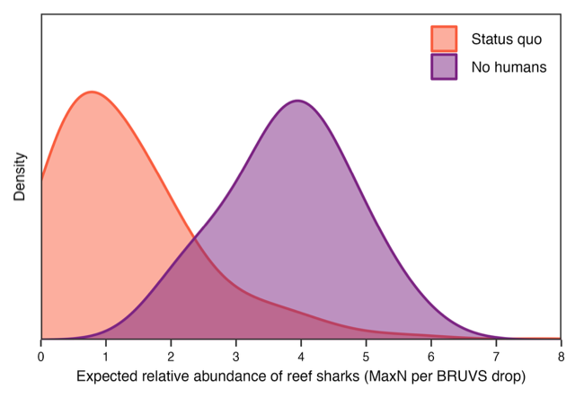

# Ecological roles and importance of sharks in the Anthropocene Ocean

Scripts for FIU-led manuscript *Ecological roles and importance of sharks in the Anthropocene Ocean*, Dedman et al 2023/4.

## EROS_Fig1A_share.Rmd

Powers Figure 1A: Millennial-scale changes in relative reef shark abundance. i: Perceived abundance of sharks off Caribbean Panama inferred from archaeological, historical, ecological, and fisheries records divided into cultural periods in Panama’s history (based on data in Dillon et al 2021. ii: Falling dermal denticle accumulation rates (proxy for relative abundance) suggest 71% (Caribbean Panama, black circles) and 756% (Dominican Republic, gray circles) declines in reef shark abundances since the mid-Holocene. Modified from Dillon et al 2021.

### Data-specific information for Fig1A

Data that are missing or not applicable are indicated with a period (“.”)

Panel i. historical ecology

Dataset: "/data/Fig1A_histecol_share.csv"
Description: Perceived ecological state of sharks in Caribbean Panama, based on archaeological, historical, ecological, and fisheries records spanning ~4ka-2020. Records were separated into seven cultural periods in Panama's history (see Dillon et al. 2021 for methodological details) and were independently reviewed by 17 individuals, most of whom identified as having a background in ecology, environmental science, paleobiology, or the geosciences (IRB Protocol #3-20-0211). Data are published in Dillon et al. 2021.
Dates collected: 2020
Nrows: 119 (excludes header)
Ncols: 3

a. response: individual reviewer id
b. time_period: temporal bin into which records were broken, consisting of pre_human (>6 ka), pre_contact (~6 ka-1500 CE), colonial (1501-1821 CE), post_colonial (1822-1903 CE), modern_one (1904-1958 CE), modern_two (1959-1999 CE), and modern_three (2000-2020 CE) (categorical)
c. score: ecological state score representing perceived abundance - scores were assigned estimated numerical values of %depletion following Kittinger et al. 2011

pristine: 5% (0-10%)
abundant: 20% (11-29%)
uncommon: 45% (30-59%)
rare: 75% (60-89%)
ecologically extinct: 95% (90-99%)
globally extinct: 100% (100%)

Panel ii. denticle accumulation
Dataset: "/data/Fig1A_denticles_share.csv"
Description: Fossil shark dermal denticles isolated from bulk samples collected from mid-Holocene and modern coral reefs in the Dominican Republic and Panama, Caribbean Sea. The data from Panama are published in Dillon et al. 2021.
Dates collected: 2014-2016
Nrows: 75 (excludes header)
Ncols: 10

a. basin: all data collected in the Caribbean (categorical)
b. region: sampling region in the Caribbean (categorical)
c. site_name: name of sampling location (categorical)
d. sample_unique: sample number, either in the format collector-year-site-replicate or collector-year-site-subsite-replicate
e. age_group: time period, based on whether the reef was fossil or modern (categorical)
f. sampling_group: randomly assigned sampling group for Dominican Republic samples where denticle counts in the individual replicates were low
g. total_dd_count: total count of denticles (discrete)
h. fragment_count: total count of denticle fragments, where less than half of the denticle crown is present, not included in total_dd_count (discrete)
i. sed_weight_kg: estimated number of years in the sample (continuous)
j. no_years: estimated number of years in the sample (continuous)

Post-processing: After producing the figures in R (R-4.2.2), minor formatting was done using Illustrator. The timeline (with time period labels) in panel i was added and the text was resized for consistency.

Written, edited, & packaged by Erin Dillon, emdillon23@gmail.com, 2023.

### Citations

Dillon, E. M., D. J. McCauley, J. M. Morales-Saldaña, N. D. Leonard, J. Zhao, and A. O’Dea. 2021: Fossil dermal denticles reveal the preexploitation baseline of a Caribbean coral reef shark community. Proceedings of the National Academy of Sciences 118:e2017735118.

Kittinger, J. N., J. M. Pandolfi, J. H. Blodgett, T. L. Hunt, H. Jiang, K. Maly, L. E. McClenachan, J. K. Schultz, and B. A. Wilcox. 2011: Historical Reconstruction Reveals Recovery in Hawaiian Coral Reefs. PLoS ONE 6:e25460.

## Figure 1B_Matias.R

powers Figure 1B: Shark landings, relative effort, and CPUE through time. Uses "/data/FAO catch by nation and year.csv"" and "/data/TotalEffortby_FishingCountry_LengthBoat_Gear_Sector.csv". Written by Matias Braccini, matias.Braccini@dpird.wa.gov.au, 2023, edited & packaged by Simon Dedman, simondedman@gmail.com, 2023.

## Counterfactual plots, 1C & 1D

Code and data to reproduce counterfactual model analyses. Written, edited, & packaged by Natalie Klinnard, natalie.klinard@dal.ca & natalie.klinard@gmail.com, 2023.

Main data file is available as part of MacNeil et al. 2020 "Global status and conservation potential of reef sharks" here: https://www.dropbox.com/s/wjwld9lrfl1a7pk/FinPrint_Set_Data.csv?dl=0

"/data/FinPrint_Set_Data.csv" and "/data/Location_Covariates.csv" are from MacNeil et al. 2020 and are used in "/Python/EROS_counterfactual_models.ipynb" to produce final distributions that are used in "/R/EROS_gravity_maxn_plots.R" to plot Figure 1D: *Counterfactual predictions of relative abundance of reef sharks in the presence (status quo) and absence of humans*.

"/data/FinPrint_reefs_gravity.csv" and "/data/totgravity_data.csv" are used in "/R/EROS_gravity_maxN_plots.R" to produce Figure 1C: *Reef shark relative abundance and number of global coral reefs along a gradient of human pressure (total gravity)*. "/data/FinPrint_reefs_gravity.csv" contains the gravity and average MaxN values associated with all 371 reefs sampled as part of FinPrint data associated with MacNeil et al. 2020. "/data/totgravity_data.csv" contains total gravity decimal values for a global distribution of coral reefs created by Dr. Eva Maire, Lancaster University.

## SankeyAlluvial.R

powers Figure 3B, Sankey/Alluvial plot, uses "/data/SankeyAlluvial.csv". Written, edited, & packaged by Simon Dedman, simondedman@gmail.com, 2023.

## TraitsRidgeplot.R

powers Figure 5B, traits ridge plot, uses "/data/Traitsridgeplot.xlsx". Written, edited, & packaged by Simon Dedman, simondedman@gmail.com, 2023. Panels arranged and annotated by Kylene Gilmore, kylenegilmoreart.com.
